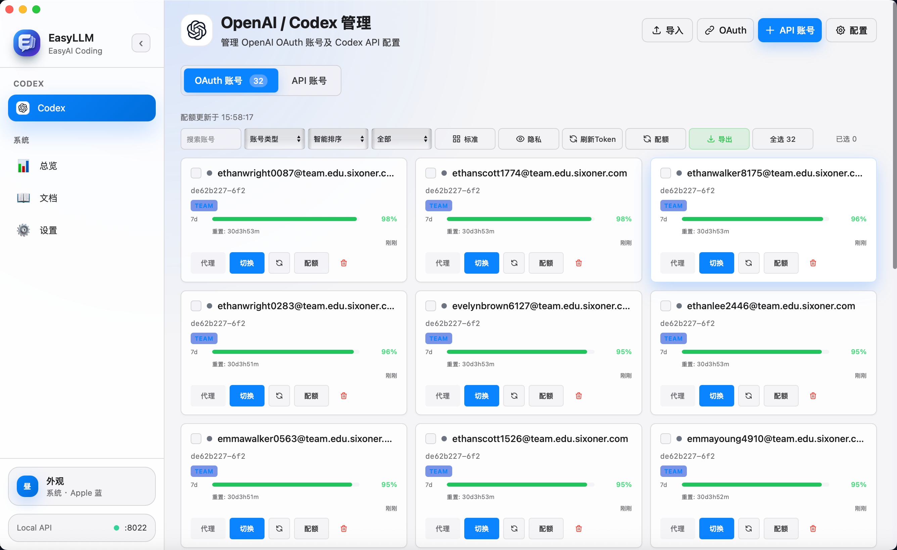

# EasyLLM

EasyLLM 是一个轻量级 OpenAI / Codex 账号管理与本地编码对接工具，后端使用 Go，前端使用 Vue 3。它把账号导入、Token 刷新、配额查询、Codex CLI 配置切换和本地 OpenAI 兼容代理集中到一个本机界面里，不提供公网部署服务。

[](https://github.com/libaxuan/EasyLLM)
[](./LICENSE)



## 核心能力

- OpenAI / Codex OAuth 账号管理、API Key 账号管理、Codex CLI 一键切换。
- 批量导入 Token、CPA、EasyLLM 备份等 JSON 格式。
- 本地代理池提供 `/v1/responses`、`/v1/chat/completions`、`/v1/models` 等 OpenAI 兼容接口。
- 支持 `round_robin`、`random`、`least_used` 轮询策略。
- 支持本机 API Key 鉴权、IP 黑名单、HTTP 代理转发。
- 默认不保留代理请求日志，避免提示词和响应内容落盘。
- 使用本地 SQLite，支持本地脚本启动和 Windows / macOS Release 打包。

## 文档入口

- [使用指南](./docs/USAGE.md)：账号导入、Codex CLI 接入、代理池、API 示例。
- [开发说明](./docs/DEVELOPMENT.md)：本地环境、常用命令、测试与构建。
- [项目结构](./docs/PROJECT_STRUCTURE.md)：源码目录、运行产物和维护约定。
- [macOS App](./macos/README.md)：原生 App 打包与运行数据位置。

## 快速开始

### Release 包

从 [GitHub Releases](https://github.com/libaxuan/EasyLLM/releases) 下载对应系统的压缩包：

- Windows：解压 `EasyLLM-*-windows-amd64.zip`，运行 `start-easyllm.bat`。
- macOS：解压 `EasyLLM-*-macos-*.zip`，运行 `EasyLLM.app`。

默认访问：

```text
http://localhost:8022
```

### 一键脚本

```bash
git clone https://github.com/libaxuan/EasyLLM.git
cd EasyLLM
cp .env.example .env
./scripts/start.sh --build
```

访问：

```text
http://localhost:8022
```

根目录 `./start.sh` 仍可用，它会转发到 `./scripts/start.sh`。

### 手动构建

```bash
cd web
npm install
npm run build
cd ..

CGO_ENABLED=1 go build -o easyllm .
./easyllm
```

### macOS App

```bash
./scripts/build-macos-app.sh
open build/macos/EasyLLM.app
```

生成 macOS Release zip：

```bash
./scripts/build-macos-app.sh --package --version 2.0.0
```

Windows Release zip 由 Windows / PowerShell 环境执行：

```powershell
.\scripts\package-windows.ps1 -Version 2.0.0 -Arch amd64
```

## 基础配置

复制 `.env.example` 为 `.env` 后按需修改：

| 变量 | 默认值 | 说明 |
| --- | --- | --- |
| `SERVER_PORT` | `8022` | HTTP 服务端口 |
| `SERVER_HOST` | `127.0.0.1` | 监听地址 |
| `DB_SQLITE_PATH` | `DATA_DIR/easyllm.db` | SQLite 文件路径；留空时和 macOS App 共用同一套本地数据 |
| `DATA_DIR` | 系统应用配置目录下的 `EasyLLM/data` | 本地数据目录；macOS 为 `~/Library/Application Support/EasyLLM/data` |
| `SECRET_KEY` | 空 | JWT/会话密钥，建议设置长随机值以便重启后保持登录 |
| `DEFAULT_PASSWORD` | 空 | 可选；留空时首次访问 Web UI 创建登录密码；如设置需至少 8 位 |
| `PROXY_ENABLED` | `false` | 出站 HTTP 代理开关 |
| `PROXY_HOST` | 空 | 出站代理主机 |
| `PROXY_PORT` | 空 | 出站代理端口 |

## 隐私与安全

- 不要提交 `.env`、`auth/`、Token/CPA JSON、EasyLLM 导出备份、私钥、API Key 或数据库文件。
- 建议启用仓库内置 pre-push 钩子：

```bash
git config core.hooksPath .githooks
```

- EasyLLM 面向本机使用，默认监听 `127.0.0.1`；不要把包含账号 Token 的本地服务对公网开放。

## 技术栈

| 层 | 技术 |
| --- | --- |
| 后端 | Go、Gin、GORM |
| 前端 | Vue 3、Vite、Tailwind CSS |
| 数据库 | SQLite |
| 运行 | 本地脚本、手动构建、Windows zip、macOS App |

## License

EasyLLM is licensed under the [Apache License 2.0](./LICENSE).

## 交流与反馈

<p align="center">
  <a href="./qun.jpg">
    
  </a>
</p>

<p align="center">
  <sub>扫码加入 Codex JSON 共享群；二维码过期时请查看仓库中的最新图片。</sub>
</p>
