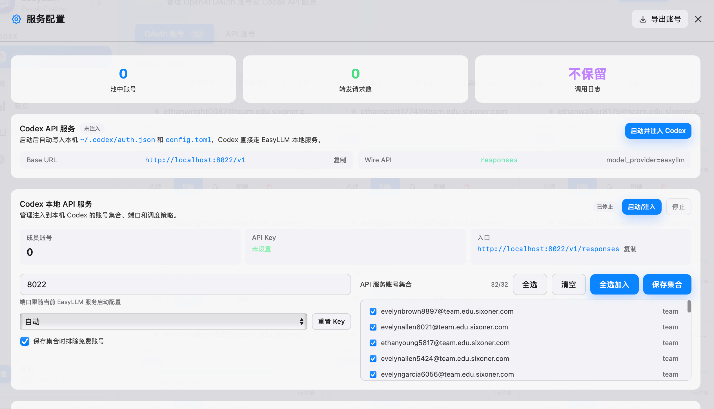

# 使用指南

本文档覆盖 EasyLLM 的日常使用流程：登录、导入账号、接入 Codex CLI、启用代理池以及调用本地 API。

## 1. 登录与初始化

首次启动后访问：

```text
http://localhost:8022
```

如果 `.env` 中设置了 `DEFAULT_PASSWORD`，服务会在首次启动时自动初始化登录密码；否则按页面提示创建密码。密码至少需要 8 位。

建议设置稳定的本地会话密钥；如需用环境变量初始化密码，请在首次启动前设置强密码：

```env
SECRET_KEY=replace-with-a-long-random-secret
DEFAULT_PASSWORD=replace-before-first-start
```

## 2. 导入账号

进入「Codex 管理」后点击「导入」，支持以下模式：

| 模式 | 适用场景 |
| --- | --- |
| Token 文件 | `token_*.json`、`codex_tokens_*.json`，支持单对象、数组、NDJSON |
| 自适应 | 自动识别 Token、CPA、EasyLLM 备份 |
| refresh_token | 只有 refresh token 列表时使用，会请求 OpenAI 换票 |
| CPA | `*-cpa.json`、`*.codex.cpa.json` |
| 从备份导入 | EasyLLM「导出账号」生成的备份文件 |

自适应导入支持选择单个 JSON、多选 JSON 或选择整个文件夹；文件夹导入会递归筛选 `.json` 文件。

## 3. Codex CLI 接入

### OAuth 账号切换

导入 OAuth 账号后，在账号卡片点击「切换」。EasyLLM 会写入本机 Codex 配置：

- `~/.codex/auth.json`
- `~/.codex/config.toml`

### API Key 账号切换

在「API 账号」标签添加：

- `model_provider`
- `model`
- `base_url`
- `api_key`
- `wire_api`

点击「切换」后写入 `~/.codex/config.toml`。

### 代理池模式

在「配置」里开启「代理池服务」，再将需要参与轮询的 OAuth 账号加入代理池。Codex CLI 可以指向本地服务：

```toml
chatgpt_base_url = "http://localhost:8022"
```



## 4. 本地代理 API

### 端点

```text
POST /v1/responses              OpenAI Responses API
POST /v1/chat/completions       Chat Completions API
GET  /v1/models                 模型列表
GET  /pool/status               兼容旧版代理池状态
```

### 示例

```bash
curl http://localhost:8022/v1/responses \
  -H "Content-Type: application/json" \
  -H "Authorization: Bearer YOUR_PROXY_API_KEY" \
  -d '{"model":"gpt-5.4","input":"hello","stream":true}'
```

## 5. 管理 API

常用管理接口位于 `/api/v1` 下：

```text
GET  /api/v1/openai/accounts
GET  /api/v1/openai/service-config
PUT  /api/v1/openai/service-config
POST /api/v1/openai/import/auto-files
POST /api/v1/openai/import/refresh-tokens
POST /api/v1/openai/accounts/fetch-quotas
GET  /api/v1/system/info
GET  /api/health
```

自适应导入通过浏览器文件选择或 multipart 上传 JSON，不再提供后端路径扫描接口。

## 6. 导出与恢复

在「配置」中点击「导出账号」可生成 EasyLLM 备份文件。该文件可能包含：

- OAuth 账号
- API 账号
- 本地 API 服务配置
- 代理池账号集合
- 轮询策略

恢复时使用「批量导入 → 从备份导入」。

## 7. 隐私与安全

- 默认不保留代理请求日志。
- 导出的账号备份包含敏感 Token，请只保存在可信位置。
- EasyLLM 面向本机 Codex/OpenAI 对接，默认监听 `127.0.0.1`，不要对公网开放。
- 不要将 `.env`、数据库、Token JSON 或导出备份提交到 Git。
