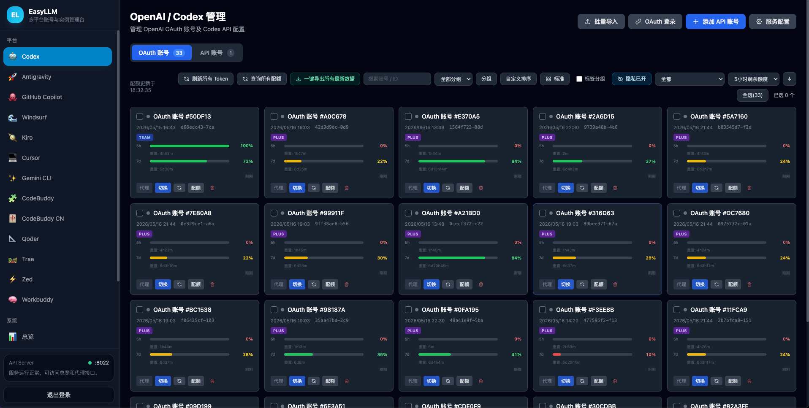

# 使用指南

本文档覆盖 EasyLLM 的日常使用流程：登录、导入账号、接入 Codex CLI、启用代理池、Relay 模式以及调用本地 API。

安装包下载请进入 [GitHub Releases](https://github.com/Xchat1/EasyLLM/releases)：

| 系统 / 设备 | 下载文件 |
| --- | --- |
| Windows 10/11 64 位 | `EasyLLM-*-windows-amd64.zip` |
| Mac Apple Silicon（M1/M2/M3/M4） | `EasyLLM-*-macos-arm64.zip` |
| Mac Intel 芯片 | `EasyLLM-*-macos-amd64.zip` |

## 1. 登录与初始化

首次启动后访问：

```text
http://localhost:8022
```

如果 `.env` 中设置了 `DEFAULT_PASSWORD`，服务会在首次启动时自动初始化登录密码；否则按页面提示创建密码。密码至少需要 8 位。

建议设置稳定的本地会话密钥；如需用环境变量初始化密码，请在首次启动前设置强密码：

```env
SECRET_KEY=replace-with-a-long-random-secret
DEFAULT_PASSWORD=replace-before-first-start
```

## 2. 导入账号

进入「Codex 管理」后点击「导入」，支持以下模式：

| 模式 | 适用场景 |
| --- | --- |
| Token 文件 | `token_*.json`、`codex_tokens_*.json`，支持单对象、数组、NDJSON |
| 自适应 | 自动识别 Token、CPA、EasyLLM 备份 |
| refresh_token | 只有 refresh token 列表时使用，会请求 OpenAI 换票 |
| CPA | `*-cpa.json`、`*.codex.cpa.json` |
| 从备份导入 | EasyLLM「导出账号」生成的备份文件 |

自适应导入支持选择单个 JSON、多选 JSON 或选择整个文件夹；文件夹导入会递归筛选 `.json` 文件。

## 3. Codex CLI 接入

### 方式一：Codex 本地 API 服务（推荐）

导入 OAuth 账号并刷新配额后，在「OpenAI / Codex → 服务配置」里点击「启动并注入 Codex」。EasyLLM 会启用本地代理池、生成本机 API Key，并写入 Codex 配置。

注入后 `config.toml` 中的关键配置：

```toml
model_provider = "easyllm"
model = "gpt-5.5"

[model_providers.easyllm]
name = "EasyLLM API Service"
base_url = "http://localhost:8022/backend-api/codex"
wire_api = "responses"
requires_openai_auth = true
supports_websockets = false
```

对应的 `OPENAI_API_KEY` 会写入 `~/.codex/auth.json`，Codex 客户端 / Codex CLI 会通过 EasyLLM 本地服务访问账号池。

### 方式二：OAuth 账号切换

导入 OAuth 账号后，在账号卡片点击「切换」。EasyLLM 会写入本机 Codex 配置：

- `~/.codex/auth.json`
- `~/.codex/config.toml`

### 方式三：API Key 账号切换

在「API 账号」标签添加：

- `model_provider`
- `model`
- `base_url`
- `api_key`
- `wire_api`

点击「切换」后写入 `~/.codex/config.toml`。

### 方式四：代理池模式

在「配置」里开启「代理池服务」，再将需要参与轮询的 OAuth 账号加入代理池。Codex CLI 可以指向本地服务：

```toml
chatgpt_base_url = "http://localhost:8022"
```

### 方式五：Relay 模式（对接第三方上游）

Relay 模式让 Codex CLI 通过 EasyLLM 对接任意 OpenAI 兼容的上游提供商（DeepSeek、Mistral、OpenRouter、Kimi、Qwen、MiMo 等），无需依赖 chatgpt.com。

进入侧边栏 **Codex → Relay**：

1. 在「上游渠道」区域点击「添加渠道」，填写上游 URL 和 API Key
2. 根据需要配置模型映射（如 `{"gpt-5.4":"deepseek-chat"}`）
3. 点击「启动并注入 Codex」，EasyLLM 自动写入 `~/.codex/config.toml`

多个启用渠道会按 round-robin 轮询；渠道 URL、API Key、认证头和认证前缀会在保存时自动去除多余空白，空 URL 的渠道不会参与转发。

注入后 `config.toml` 中的关键配置：

```toml
model_provider = "relay"
model = "your-model"

[model_providers.relay]
base_url = "http://localhost:8022/v1"
wire_api = "responses"
requires_openai_auth = false
```

详细说明见 [Codex Relay 集成说明](./CODEX_RELAY_INTEGRATION.md)。



## 4. 本地代理 API

### 端点

```text
POST /v1/responses              Responses API（含 Relay 协议转换入口）
POST /v1/chat/completions       Chat Completions API
GET  /v1/models                 模型列表（代理上游或代理池）
GET  /pool/status               代理池状态（兼容旧版）
```

### 示例

```bash
# Relay 模式：非流式
curl -X POST http://localhost:8022/v1/responses \
  -H "Content-Type: application/json" \
  -d '{"model":"gpt-5.4","input":"你好","stream":false}'

# 代理池模式：流式
curl http://localhost:8022/v1/responses \
  -H "Content-Type: application/json" \
  -H "Authorization: Bearer YOUR_PROXY_API_KEY" \
  -d '{"model":"gpt-5.4","input":"hello","stream":true}'
```

## 5. 管理 API

常用管理接口主要位于 `/api/v1` 下；`/api/health` 和 `/pool/status` 是兼容旧版的公开接口：

```text
GET  /api/v1/openai/accounts
GET  /api/v1/openai/service-config
PUT  /api/v1/openai/service-config
POST /api/v1/openai/import/auto-files
POST /api/v1/openai/import/refresh-tokens
POST /api/v1/openai/accounts/fetch-quotas
GET  /api/v1/relay/config
PUT  /api/v1/relay/config
GET  /api/v1/relay/usage
DELETE /api/v1/relay/usage/history
GET  /api/v1/relay/logs
GET  /api/v1/relay/logs/stream
DELETE /api/v1/relay/logs
POST /api/v1/relay/sessions/clear
GET  /api/v1/relay/sessions/stats
POST /api/v1/relay/inject-codex
GET  /api/v1/health
GET  /api/v1/system/info
GET  /api/health
GET  /pool/status
```

自适应导入通过浏览器文件选择或 multipart 上传 JSON，不提供后端路径扫描接口。

## 6. 导出与恢复

在「配置」中点击「导出账号」可生成 EasyLLM 备份文件。该文件可能包含：

- OAuth 账号
- API 账号
- 本地 API 服务配置
- 代理池账号集合
- 轮询策略

恢复时使用「批量导入 → 从备份导入」。

## 7. 隐私与安全

- 默认不保留代理请求/响应正文。
- Relay 调用统计只保存时间、上游、模型和 Token 用量等元数据；不保存请求提示词或模型响应正文。
- 导出的账号备份包含敏感 Token，请只保存在可信位置。
- EasyLLM 面向本机 Codex/OpenAI 对接，脚本模式默认监听 `127.0.0.1:8022`，不要对公网开放。
- 不要将 `.env`、`data/`、`auth/`、数据库、Token/CPA JSON、导出备份、日志、`build/`、`web/dist/` 或本地助手目录提交到 Git。
- 生成 release zip 后，建议运行 `./scripts/check-release-archives.sh build/release/*.zip` 检查发布包是否包含私有文件或疑似密钥。
